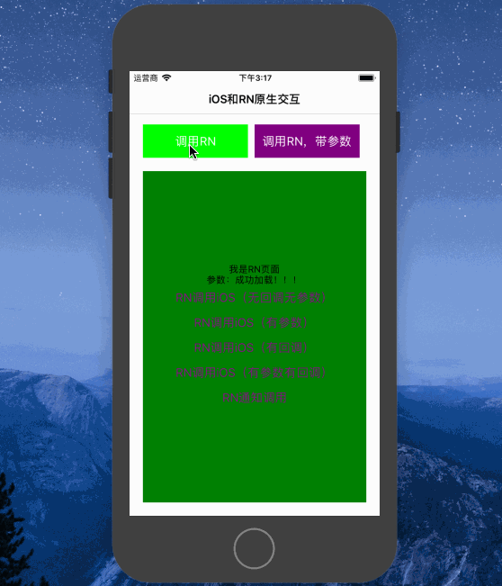

# RNInteractWithiOS

> 例子介绍了RN和iOS如何进行原生交互，需要注意的地方

## 内容

* RNInteractWithiOS 项目文件
* Snapshots 示例演示

## 示例



### 运行

如果没有安装RN环境，请注释DEBUG代码，使用本地jsbundle文件进行示例演示即可。

```
#if DEBUG
    return [NSURL URLWithString:@"http://localhost:8081/RN/index.bundle?platform=ios"];
#else
    return [[NSBundle mainBundle] URLForResource:@"index" withExtension:@"jsbundle"];
#endif
```

## 总结

以上均是开发过程的积累，学到哪记到哪

原创文章，转载请注明出处，谢谢！
